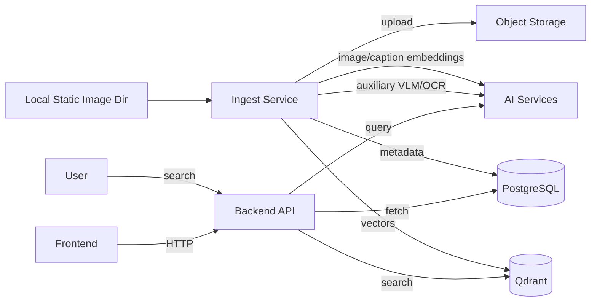

# GEMINI.md - Repository-wide Context for AI Assistants

This is the emomo monorepo: an AI-powered meme search engine with backend and frontend subprojects. Subproject-specific GEMINI.md files contain the details:

- [backend/GEMINI.md](backend/GEMINI.md) — Go backend (REST API + ingestion + Qdrant/storage)
- [frontend/GEMINI.md](frontend/GEMINI.md) — React + Vite frontend

## 1. Repo Layout

```
backend/      Go 1.26.2 + Gin, ingestion + REST API
frontend/    React 19 + Vite SPA
deployments/ Cross-service Docker Compose (API + Grafana Alloy)
docs/        Cross-service design and ops docs
scripts/     Cross-service helpers (start.sh)
```

## 2. End-to-End Data Flow



## 3. Common Tasks

### Local dev

```bash
./scripts/start.sh                 # backend (8080) + frontend (5173)
docker compose --env-file backend/.env -f deployments/docker-compose.yml up -d   # API + Alloy
```

### Per-subproject

```bash
cd backend && go run ./cmd/api
cd frontend && npm run dev
cd backend && ./scripts/import-data.sh -p ./data/memes  # only supported data ingest entrypoint; imports all images by default
cd backend && GOTOOLCHAIN=go1.26.2 go run github.com/bufbuild/buf/cmd/buf@v1.69.0 generate
```

## 4. Current Backend Data Model

- Default retrieval is not "image -> VLM description -> text vector". Ingest writes direct image embeddings to Qdrant, and text queries are embedded into the same multimodal space.
- VLM/OCR data is auxiliary. It is stored in `meme_annotations` and used for display, OCR text, caption/BM25 routes, and structured filters.
- The relational database has three core tables: `memes`, `meme_annotations`, and `meme_vectors`.
- Protobuf defines the backend HTTP request/response/SSE DTOs, generated frontend/backend DTOs, closed cross-boundary enums, and the explicit structured DB JSON values `memes.image_info` and `meme_annotations.labels`. It does not own relational table shape, migrations, runtime config, open string sets, repository internals, or React UI state. Source `.proto` files live in `backend/proto/emomo/v1/` (`types.proto` / `meme.proto` / `api.proto`); generated code lands in `backend/gen/` (Go) and `frontend/gen/` (TS).

## 5. Conventions

- Branch from `main`. Use Conventional Commits prefixes (`feat:`, `fix:`, `chore:`, `docs:`, `refactor:`).
- Cross-subproject changes: scope by directory in the commit body.
- Each subproject has its own `.env.example`. Don't put secrets in repo root.
- The Go module path (`github.com/timmy/emomo`) is independent of file paths; moving files does not require import rewrites.

## 6. Deployment Surfaces

- Render — `render.yaml` (`rootDir: backend`).
- Railway — `railway.json` (`dockerfilePath: backend/Dockerfile`).
- Hugging Face Space — GitHub Actions splits `backend/` as a subtree and force-pushes to the Space; the Space's filesystem root equals `backend/`.

## 7. Testing

- Backend: `cd backend && go test ./...`.
- Frontend: `cd frontend && npm run test` (Playwright e2e).
