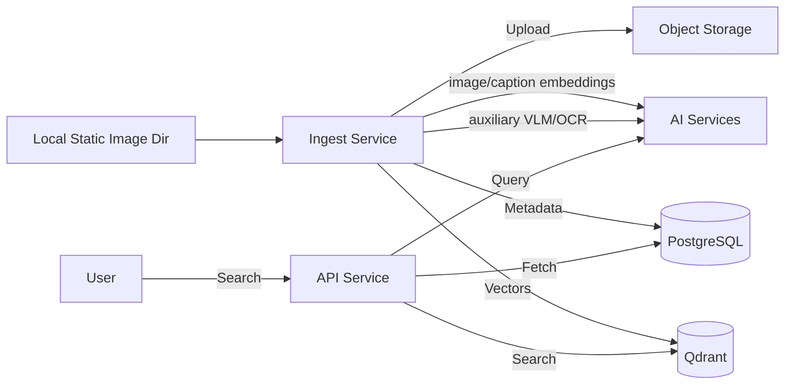

# GEMINI.md - Backend Context for AI Assistants

This file describes the Go backend of the emomo monorepo. For repo-wide context see [../GEMINI.md](../GEMINI.md); for the React frontend see [../frontend/GEMINI.md](../frontend/GEMINI.md).

All commands below assume `cd backend` unless noted.

## 1. Project Overview

**Emomo** is a meme search engine that ingests memes from a local static image directory, indexes images with multimodal embeddings, and provides a semantic search API. VLM/OCR output is stored as auxiliary annotation data, not as the primary retrieval representation.

### Core Components
*   **Ingestion (Go, `cmd/ingest`):** consumes local static image directory data, validates/normalizes images, uploads images to object storage (S3/R2), writes `memes`, embeds image/caption routes, indexes vectors in Qdrant, and stores Qdrant point records in `meme_vectors`.
*   **Annotations:** VLM description, OCR text, and structured labels live in `meme_annotations`. The "has visible text" tag is `labels.text.present`.
*   **API (Go, `cmd/api`):** REST API (Gin) for searching memes; uses optional query expansion, direct image-vector search, caption dense search, and BM25 sparse search.

## 2. Technology Stack

*   **Languages:** Go 1.24+ (this directory).
*   **Web Framework:** Gin (Go).
*   **Databases:** PostgreSQL (primary metadata, GORM) and Qdrant (vector search).
*   **Storage:** S3-compatible object storage (Cloudflare R2, AWS S3, or MinIO).
*   **IDL:** protobuf schema lives in `proto/emomo/v1/schema.proto`; generated Go code lives in `internal/idl/emomo/v1/`. The IDL is intentionally structured-value-only (`ImageInfo`, `MemeAnnotationLabels`, `TextLabel` + `ImageFormat` / `VectorType` enums), not a wire / RPC contract; relational rows themselves are GORM structs in `internal/domain/`.
*   **AI Models:** Qwen3-VL multimodal embeddings are the default for image/caption/query vectors; OpenAI-compatible VLM/OCR is auxiliary.
*   **Infrastructure:** Docker Compose for local development (`../deployments/docker-compose.yml`).

## 3. Architecture & Data Flow



## 4. Key Directories (within backend/)

*   `cmd/api/`: REST API server entry (`main.go`).
*   `cmd/ingest/`: Ingestion CLI (`main.go`).
*   `internal/api/`: HTTP handlers and routers.
*   `proto/`: protobuf IDL for column-level structured values and closed enums (not a wire/RPC IDL).
*   `internal/idl/`: generated Go protobuf code.
*   `internal/service/`: Business logic (search, ingest, VLM/OCR, embedding, query expansion).
*   `internal/repository/`: Data access layer (DB, Qdrant). `db.go` owns every database migration in code (GORM AutoMigrate + `prepareLegacy*` / `migrate*` / `dropLegacy*` helpers); there is no SQL migration runner.
*   `internal/source/`: Adapters for ingestion sources (`localdir`).
*   `configs/`: `config.yaml`, `config.cloud.yaml.example`, `huggingface-spaces.env.example`.

## 5. Development & Usage

### Prerequisites
*   Go 1.24+
*   Docker & Docker Compose

### Local Setup
1.  Configuration: `cp .env.example .env` and fill in API keys.
2.  Optional infra: `docker compose --env-file backend/.env -f deployments/docker-compose.yml up -d` (from repo root) to start API + Alloy.
3.  Prepare local static image data:
    ```bash
    mkdir -p ./data/memes
    ```
4.  Ingest: `./scripts/import-data.sh -p ./data/memes -l 50`.
5.  API server: `go run ./cmd/api`. Defaults to `http://localhost:8080`.

### Common Tasks

*   **Add new ingestion source:**
    1.  Implement `internal/source/Source` interface.
    2.  Register in `cmd/ingest/main.go` and `cmd/api/main.go`.
*   **Add new embedding model:**
    1.  Add an entry under `embeddings:` in `configs/config.yaml` (provider, dimensions, collection, api_key_env).
    2.  Verify it loads via `internal/service/embedding_registry.go`.
*   **Change schema-level types:**
    1.  Edit `proto/emomo/v1/schema.proto`. Only add column-level structured values or closed enums — the project does not speak protobuf on the wire, so do not reintroduce top-level `Meme` / `MemeAnnotation` / `MemeVector` messages.
    2.  Run `go run github.com/bufbuild/buf/cmd/buf@v1.69.0 generate`.
    3.  Keep the relational schema centered on `memes`, `meme_annotations`, and `meme_vectors`.
*   **Database migrations:** managed entirely in code via `internal/repository/db.go` (GORM AutoMigrate plus explicit `prepareLegacy*` / `migrate*` / `dropLegacy*` helpers). Add new migration logic and a regression test in `internal/repository/db_test.go`; do not introduce a parallel SQL migration runner.

## 6. Testing

*   **Go Tests:** `go test ./...`.
