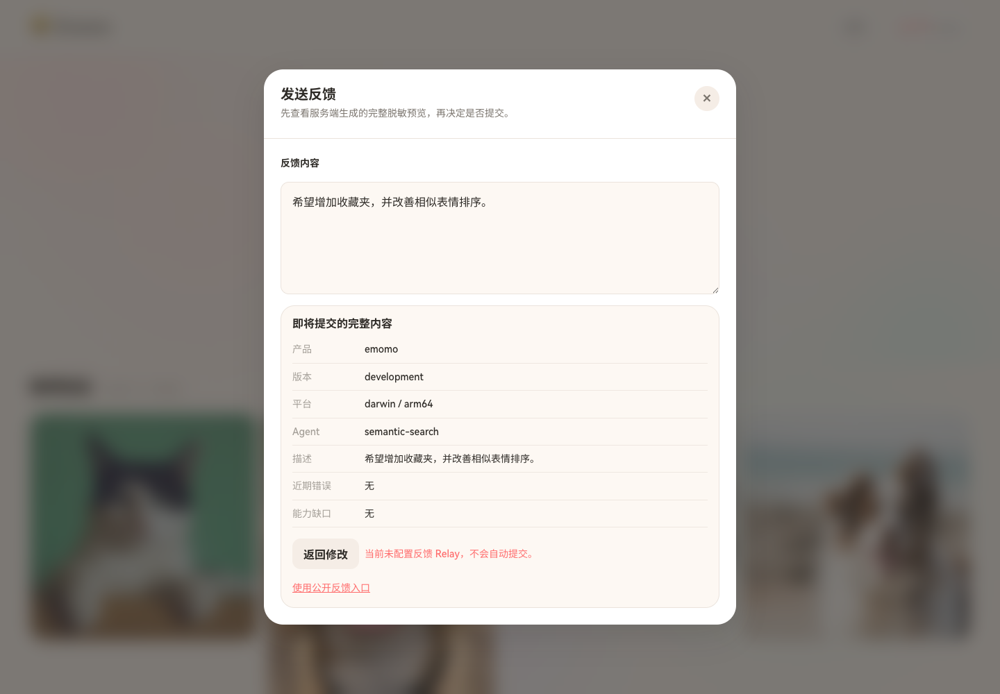

# Awesome Agent App Features integration

Emomo is a public, non-CC adopter of the `feedback` Feature from `timmyagentic/awesome-agent-app-features`.



## Immutable source

- Module version: `v0.1.0`
- Exact source commit: `f5b3e69a7a451f8377dece49c7d0dd8cf5d3fc3c`
- Deliveries used: `feedback` and `feedback/httpclient` Go packages
- Source subtree Relay: not copied; the operator may configure a separately deployed author-owned Relay.

The module stays on the published `v0.1.0`; the newer exact source revision supplies the CI-verified manifest, nested-module lock schema, and same-commit stateless validator. Validation also proves that the consumed `feedback` package bytes still match this source revision.

`agent-app-features.lock.json` records the exact dependency, affected host files, current verification, and `UNVERIFIED` production boundaries. It contains no endpoint value, credential, payload, log, user identifier, or runtime state.

## Host-owned flow

1. The Web user opens “反馈” and enters a description.
2. `POST /api/v1/feedback/preview` uses the Foundation Builder and returns the complete redacted `Draft.Report()` projection. It makes no Relay request.
3. The UI displays product, version, OS, architecture, Agent, description, recent error, and capability gaps.
4. Editing the description invalidates the preview. Closing, cancelling, or previewing makes zero submission requests.
5. Only “确认并提交这份脱敏反馈” sends the exact preview input with `user_approved=true` to `POST /api/v1/feedback/submit`.
6. The backend rebuilds the deterministic draft, calls `Approve(true)`, and submits opaque `Approved` through the Foundation HTTPS client.
7. With no Relay endpoint configured, submission is disabled and the UI offers the public GitHub Issue fallback.

The frontend owns copy, modal behavior, localization, explicit confirmation, fallback, and failure UX. The backend owns Emomo environment mapping and optional endpoint configuration. The Foundation owns redaction, bounds, opaque approval, the exact `/v1/feedback` wire contract, and no-redirect transport. The Relay owns its target repository, credentials, deduplication, and downstream presentation.

## Configuration

```text
FEEDBACK_ENDPOINT=                         # optional exact HTTPS /v1/feedback URL
FEEDBACK_PUBLIC_FALLBACK_URL=https://github.com/timmyagentic/emomo/issues/new
FEEDBACK_PRODUCT_VERSION=development
```

Do not place a GitHub token or downstream repository selector in Emomo. Production Relay deployment and a real credential-backed issue submission remain `UNVERIFIED` until separately authorized and executed.
