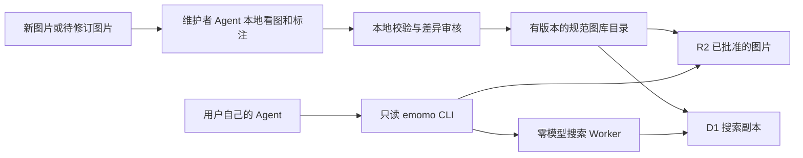

# Emomo 后续图库维护方案

2026-10-06，Asia/Shanghai。基于实际图库审计和当前代码的设计方案；本次只交付文档，没有新增维护命令、运行标注、修改生产数据、创建资源或上线。

## 选择

图库的新增和修订由维护者的 Agent 在本地准备。它在当前会话中看图、写描述、读取文字、提出标签，用自己的账号额度；Emomo 云端接收已经准备好的资料，完成校验、存储和确定性索引。搜索、补标和失败重试都不触发云端 LLM/embedding。

现有 12,830 张完整描述直接复用；65 张仅有文字存在标记的图片保留详情/下载并标记待补描述；1 张 R2 孤立图片保留待核对。增长以有限的小批次进行。首版由一个维护者管理，消费 CLI 保持只读，不引入公开写入、自动爬取、云端自动补标或定时流水线。

## 职责和数据归属

| 角色/组件 | 职责 | 权限/模型费用 |
|---|---|---|
| 使用者的 Agent + emomo skill | 理解请求、改写短关键词、根据候选看图选图 | 只读图库；消耗使用者自己的 Agent 额度 |
| 消费 emomo CLI | 搜索、详情、下载、状态检查 | 无 Cloudflare/数据库/模型管理凭据 |
| 维护者的 Agent | 看待入库图片、生成/修订描述/OCR/标签、检查差异 | 当前维护会话额度；不把模型凭据交给 Emomo |
| 拟建本地维护工具 | 文件校验、hash/去重、生成待办、版本、差异、发布记录和重建 | 维护权限留在维护机器；默认本地操作 |
| 独立搜索 Worker | 查询已审核文本，返回 canonical ID 和现有图片地址 | 只读搜索；0 模型调用 |
| D1 | 服务当前图库的检索副本 | 可以从规范目录重建 |
| 公开 R2 图片桶 | 提供已批准发布的静态图片 | 对象存储/缓存费用 |
| 拟建私有档案存储 | 规范目录、修订历史、来源、发布清单、下架记录、备份 | 不接公开域名、不启用 r2.dev；不进入消费 CLI |
| 现有 Supabase | 保留历史数据及迁移依据 | 按用户要求保持运行；新图维护不再双写旧库 |

规范图库目录是以后新增/修订的依据；D1 是供查询的投影，不能成为唯一档案。初始目录来自已经只读导出的 PostgreSQL 数据，随后由批准的版本向前推进。后续重新导出旧库不能覆盖新目录。

私有目录保留 canonical meme/annotation，同时独立记录状态、修订号、来源、校验和、审核记录。公共 HTTP DTO 继续沿用现有 protobuf；这些维护字段不作为第二套公开 DTO，也不把整份私有档案交给使用者。

## 新增一批图片

建议默认每批最多 50 张，需要扩量时明确指定数量和总字节限制。一次发布必须有可审阅的新增/修改/下架/上传体积清单，不能用“扫描整个磁盘”作为默认输入。

1. **明确本地来源。** 用户指定目录或文件。图片先进本地待办；若以后接受他人贡献，贡献者只提供本地整理的图片和元数据，不获取发布权限，也不提交模型凭据或聊天历史。
2. **先处理字节。** 检查实际格式、解码、尺寸、大小和动画特征，拒绝损坏文件；展示文件保留需要的透明通道，处理附带私人信息。沿用静态 JPEG/PNG/WebP 范围。动画 GIF/APNG/WebP 须另行支持，不能把第一帧当成完整动画悄悄入库。
3. **在模型前去重。** 精确重复复用原 ID/图片，不再上传，也不再看图生成一次相同标注。近似图片列成待复核候选；不同字幕、动作和用途应保留。
4. **维护 Agent 准备文字。** 输出简洁的画面描述、能可靠识别的 OCR、文字存在状态、少量事实标签和可解释的使用场景。文字看不清就保留未知/待核对，不编造 OCR；存在文字但未转录时保留 has_text=true。
5. **本地校验与审核。** 复用 canonical 字段校验，检查 ID/图片 hash/关联、元数据完整性、状态、禁止导入的 URL/凭据，以及对旧记录的修改。Agent 可以完成已经被授权的批次审核，不要求用户逐张点确认。
6. **明确发布。** 被批准的图片/元数据才进入发布批次。缺标资料留在待办；云端不补标，不转向其他模型，也不重试旧摄入流水线。

维护 Agent 没有视觉能力或会话额度不足时，图片保持待办；可以由用户提供文字资料后审核。消费 Agent 没有视觉能力时依据已有描述选择，并说明无法核对画面。两种情况都不会由 Emomo 自动调用其他模型补救。

文字存在状态应表达“有字 / 无字 / 未知”，OCR 的“已提取 / 未提取 / 不可辨识”单独记录。当前 importer 能保留明确 has_text，但对缺 labels 仍用 OCR 推导；新维护输入的显式未知状态需要实现后单独验证，不能把缺 OCR 一概当无字。

现有 tags/category 全空，并不妨碍已有描述检索。首版不强制给 12,895 张重新打标签。新图可逐步补主体/动作/情绪等标签，已有图只针对确认影响搜索的记录修订；抓取关键词、作者和来源 URL 继续留在私有出处记录。

## 去重和身份

实际旧数据的 12,895 个 content_hash 全是 32 位 MD5，全部与 storage key 文件名相同；旧流水线对转换后的展示字节计算 MD5。保留现有 UUID、MD5 和 key，不批量改名或重编码。

新图片记录展示字节 SHA-256，同时计算兼容 MD5 对照旧库；仅 hash 匹配还需核对文件/尺寸等一致性，不能把不一致的对象覆盖掉。建议新资产用 SHA-256 内容寻址并显式记录算法，旧 key 继续有效；canonical content_hash 字段是字符串，维护档案说明其算法，不假定所有记录都是同一长度。

近似去重用本地确定性指纹/尺寸等生成候选，维护 Agent 或人工比较。图像相似不代表表情包用途相同，尤其不能自动合并不同文字的图。既有库在没有近似复核前不声称“没有视觉重复”。

image ID 是业务身份，image key 是文件身份。修订描述沿用 ID/key；修改图片内容用新 key，保留历史及明确关联，不覆盖内容寻址对象。ID 与原稿/新稿关联要留在目录里，防止历史下载链接指向另一张图。

## 修订与版本

每条变更携带原版本或原记录摘要、变更字段、修改原因和来源。旧内容保留为修订历史；版本不匹配就报冲突，不能覆盖后来已经批准的内容。

原始标注、审核通过的标注和当前发布的标注分开记录。发布使用明确批准的版本，不再用 updated_at 最大值当作“最好标注”。今后即使存在一次低质量新标注，也不会覆盖旧的完整描述。

描述/OCR/标签变化只更新对应索引行和 FTS，不重新处理图片、不生成任何向量。同一个批次和相同 ID 的重试必须幂等；每张已成功图片都有结果，未完成的不标记为成功。

消费 Worker 仍只处理字面检索。查询改写/同义词理解归消费 Agent；改进文字质量、短语权重和多词匹配规则时，必须通过固定样例验证，不能加入云端模型兜底。

## 公开、隐藏和撤回

| 状态/操作 | 搜索/详情 | 图片/档案 | 恢复规则 |
|---|---|---|---|
| draft | 不进入公共索引 | 本地或私有待办 | 通过审核才能发布 |
| approved | 已获批准，尚未激活 | 准备版本和图片 | 明确发布后生效 |
| active | 当前可用；历史 65 张可保留详情但不可文本命中 | 已批准图片公开，私有历史保留 | 可修订或隐藏 |
| hidden | 从公共搜索及详情移除 | 源档案保留；已有公开图片 URL 可能仍可用 | 显式取消隐藏后重新发布 |
| withdrawn | 公共搜索/详情禁止；阻止相同资产重新发布 | 先保留私有副本，再撤回公共对象并处理缓存/其他公开入口 | 不能随普通索引回滚恢复 |

下架不是输入文件里少一行就自动删除。当前 build-index 只做 upsert，遗漏记录不会移除；后续维护工具必须生成明确的下架/删除投影清单，执行后验证 FTS、详情、类别和统计一致。

要停止公网提供某张图片，须把已批准的隐藏升级为公共资产撤回，核对内容 hash/别名引用，保留可验证的私有副本，再处理所有公开对象入口和缓存。公开 R2 对象的旧链接不会因为删除 D1 行而失效。

R2 的 custom domain 和 r2.dev 是独立公开入口。正式图片服务宜使用长期保留的自定义域名，单独决定关闭开发入口；不能只处理其中一个地址就宣布撤回完成。[R2 公开桶说明](https://developers.cloudflare.com/r2/buckets/public-buckets/)

R2 源对象删除后，缓存副本仍可被访问。公共撤回需验证缓存失效和真实读取；已被其他人下载的本地副本无法由 Emomo 远程收回。[R2 一致性与缓存](https://developers.cloudflare.com/r2/reference/consistency/)

隐藏/撤回清单要独立于旧版本快照持续保留，并按 ID 与资产 hash 记录。恢复旧索引必须叠加当前清单，防止下架图片因回滚或换 ID 重新出现。源图和全部备份的最终清除另行明确决定，首版不自动清除历史数据。

## 批次发布与失败处理

首版采用低频小批次和短维护窗口。R2、私有档案和 D1 不处于一个跨服务事务，不能保证“一条命令中途任何地方失败都自动全部回滚”。

1. 本地完成准备、差异、图片校验和代表性查询，固定 batch ID、base revision、目标 revision 和对象 key。
2. 保存候选规范目录和变更日志；确认目标账户/数据库/桶。管理凭据来自维护机器的正常安全机制，不通过公共搜索接口转交。
3. 在获得本批生产发布授权后，暂停新的 Agent API，准备私有版本快照，上传已批准的新图片并核对结果。尚未开始服务时保持默认禁用即可。
4. 应用批准的 upsert 和明确下架的索引移除，保存进度。对安全大小的 D1 批次需要通过实际调用方式证明事务行为；整个多批次 SQL 文件/R2 上传不是单个原子操作。
5. 记录数/ID/文字状态、FTS 内容、固定查询、图片读取和变更清单全部通过后，激活目标版本与缓存版本，再恢复新 Agent API。旧模型后端保持停服。
6. 网络结果未知时，先核对同 batch ID/对象/记录是否成功，再按原 ID/key 重试；失败批次保持未发布状态，API 保持暂停，人工或授权维护 Agent 决定续跑/恢复旧版本。

D1 Worker API 的 batch 在 D1 内有事务/失败回滚语义。它不会同时撤销已经成功的 R2 上传；具体维护 CLI 的传输方式仍需实现与故障注入验证。[D1 batch 说明](https://developers.cloudflare.com/d1/worker-api/d1-database/#batch)

当前 Worker 内部缓存键没有图库版本号。下一阶段必须加入由服务端确定的目录版本，不能把请求方提供的 revision 当成可信值。普通更新明确说明允许的短缓存滞后；紧急撤回需同时保证索引/详情/公开图片路径的拒绝行为。客户端长期缓存与已下载文件也不能用一次 Worker cache 删除解决。

为了节约写入，日常使用小批次差异更新；全量重建用于首批导入、索引结构变更、故障恢复。12,895 张没有必要每加一张都重新导入一遍。

## 档案、备份和恢复

维护档案至少包括 canonical 数据、批准版本/变更日志、出处、下架清单、图片 hash/key 清单、schema/index 规则版本和发布验收。索引是可重建的；源档案和图像才是要长期保全的资产。

每次发布保留一个带校验和的不可覆盖快照，另有长期本地副本；图片需有经过验证的独立备份，公共撤回前至少确保对应原图在私有位置可恢复。保留周期/历史清理由明确政策决定，不自动清理现有原始数据。

当前 canonical JSONL 9,762,471 字节，实际本地 gzip level 6 后 2,841,948 字节，版本备份的元数据很小。压缩是存储措施，不是备份验证；恢复仍需逐行校验、重建索引和读取图像。

当前导出/备份位于 worktree 的 gitignored data/ 目录。下一阶段要复制到长期归档位置，防止清理 worktree 时遗失；本次没有移动或删除现有快照。私有云备份使用独立私有桶，不能在已经公开的图片桶下放一个 backups/ 前缀就当成权限隔离。

恢复流程：选批准快照 → 验证完整性/规则版本 → 叠加最新隐藏/撤回清单 → 从仍保留的图像清单生成索引 → 本地/目标环境验收 → 明确切换。包含 FTS 虚拟表的 D1 不依赖普通 SQL export 作为唯一备份。[D1 导入导出说明](https://developers.cloudflare.com/d1/best-practices/import-export-data/)

现有 Supabase 按用户要求保持运行，作为历史源保留，不自动退役。业务四表 dump 已能解析并核对行数，但实际 PostgreSQL 实例恢复尚未验证；Qdrant 向量本体读取/恢复也未验证。这些限制不影响已验证的本地文字索引，但不能因此宣布旧数据已完整迁移和可删除。

## 成本和搜索质量

云端没有模型 SDK、AI binding、模型凭据或自动标注链路，因此没有新版图库搜索/摄入的云端模型账单。维护 Agent 补标和使用者 Agent 看图仍消耗各自会话额度，不能把这描述成 AI 工作完全免费。

增长成本由发布清单里的图片张数/字节、已有记录复用率、索引写入、私有快照与保留资源决定。默认批次上限、模型前去重、只修订问题记录、差异更新和直接下载选中的图片可以降低费用。Worker/D1/R2/缓存/日志/域名及保留服务仍可能收费；现有每 IP 限流不是账户费用硬上限。

消费端继续默认返回 8 条元数据，通常只下载真正需要看/展示的少量候选，不拉取全库。每 IP 限流、请求/候选上限保留。是否增加全局日用量拒绝策略，要根据实际上线读写计量设计并验收；它无法消除攻击流量、其他资源和已发生请求的全部基础设施费用。

质量维护以一组固定意图/关键词及预期图片为依据，包含“谢谢老板”这类多词部分匹配、无字图片和 OCR 原文。未来索引/标注变更需要比较前若干候选，发现退化就暂停发布。现有 99.50% 是描述覆盖率，不是搜索准确率。

反馈可由用户明确指定某张图的描述错误、没有合适结果或需要下架，维护 Agent 整理为本地修订任务。首版不自动收集对话、搜索历史或把每次用户查询写回图库。

## 接下来实现什么

| 优先顺序 | 要实现的能力 | 验收重点 |
|---|---|---|
| 1 | 本地 prepare / validate / diff 与规范目录版本 | 无网络模型调用；精确重复复用；缺字段清楚报告；资料私有 |
| 2 | 独立维护 skill + 65 张补标流程 | 当前 Agent 逐图提出元数据；明确/未知文字状态正确；差异可审阅 |
| 3 | 管理发布工具、下架投影、进度与目录版本缓存 | 重试幂等；中途失败不激活；下架不残留；不允许普通消费端写库 |
| 4 | 私有长期档案、图像备份、恢复演练 | 能从档案/图像重建；回滚不恢复撤回内容；备份不在公开桶 |
| 5 | 经授权后的正式图库导入与上线 | 生产兼容/图片域名/计量/费用/CLI 功能验证；零模型边界继续成立 |

维护工具建议与消费 CLI 分开，先作为仓库内本地工具和维护 skill。上述名称描述计划功能，当前不能当作已存在的可执行命令。现在 CLI 只有搜索、详情、下载等消费能力；已有 index builder、canonical validator 和 FTS 触发器可以复用。

当前尚缺明确批准版本选择、草稿/下架档案、发布 ID/重试记录、显式删除计划、目录版本缓存、远程备份与恢复工具。现有 Supabase Data API 暴露问题仍等待此前单独确认，本次分析没有获得配置变更授权。[Supabase Data API 安全说明](https://supabase.com/docs/guides/api/securing-your-api)

代码依据：[当前只读 CLI](../cli/src/cli.js)、[离线索引构建器](../deployments/cloudflare/agent-search/scripts/build-index.ts)、[metadata 校验与 upsert](../deployments/cloudflare/agent-search/src/metadata.ts)、[FTS 触发器](../deployments/cloudflare/agent-search/migrations/0001_text_index.sql)、[搜索与缓存](../deployments/cloudflare/agent-search/src/index.ts)。实际图库与原始备份证据见 [图库导入审计](LIBRARY_IMPORT.md)。

## 2026-10-08 本地维护落地

CLI 0.3.0 同包安装独立 `emomo-library`，提供 prepare / validate / diff；实现见 [library.js](../cli/src/library.js)。它从已审核本地 catalog 生成有 collection 作用域、revision 名称及内容摘要的独立私有快照，完整复制图片及动画字节，拒绝覆盖。validate 校验记录、格式魔数、相对资产路径和 SHA-256；diff 明确新增、修订字段、图片更换、计划移除、词表变化及新资产体积。同 hash 的资产复用，移除仅为计划，不影响原件。它没有公开发布、上传或网络模型调用。

这实现了优先顺序 1 中的本地版本、校验、差异基础。快照内记录沿用本地图库元数据，尚未生成云端 canonical 导入数据；批准版本选择、修订历史、下架清单、发布进度和服务缓存版本仍待实现。记录无 OCR 时保持本地 unknown，未改为 without_text。

GIF/动画不会转成第一帧；目前远程静态链路不兼容的 ID 和未核实公开传播授权的 ID 单独列在 review.json。publicReleaseReady 固定 false，明确批准不能由这个工具代替。快照不依赖开发 worktree，但与原件同外置盘的副本不等于异地备份。该工具只验证结构/字节，不替代画面审核和原始图片解码结果。

## 2026-10-08 首期静态共享链路准备

用户进一步决定第一期放弃GIF，先不开发。该决策替代上一步先补GIF远程支持的计划；GIF单帧也排除，原件不清理。709项静态（673表情、36物件）用于首期本地准备。

`deployments/cloudflare/agent-search` 的 `static:prepare` 从已校验私有快照生成 canonical JSONL、D1 SQL、静态对象清单和完整字节副本；仅本机、拒绝覆盖。无OCR时内部 text_presence 明确保留unknown；查询别名/场景只入确定性文字索引，不成为公共事实tags。默认搜索排除object_sticker，显式分类才能查询物件。

`static:verify` 可以用指定真实导入包和查询用例重跑安装CLI→本地D1→详情→源字节下载，并保存验收证据。验证结束关闭服务，不更改本机默认图库。具体运行步骤见 [共享搜索README](../deployments/cloudflare/agent-search/README.md)。规范档案、导入包、私有源信息与验收下载不进入Git。

这仍不是生产发布。当前共享服务默认禁用，图片和索引尚未远程上传。持续目录版本缓存、发布批准版本、远程计量/兼容、上线授权和运行验收仍待处理；公共素材权限UNVERIFIED，准备副本不能替代发布许可。
