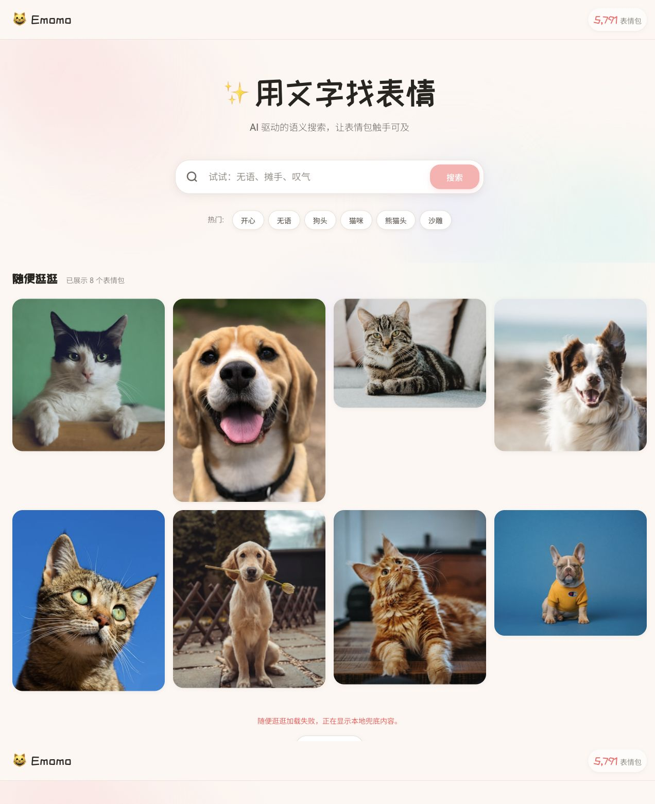
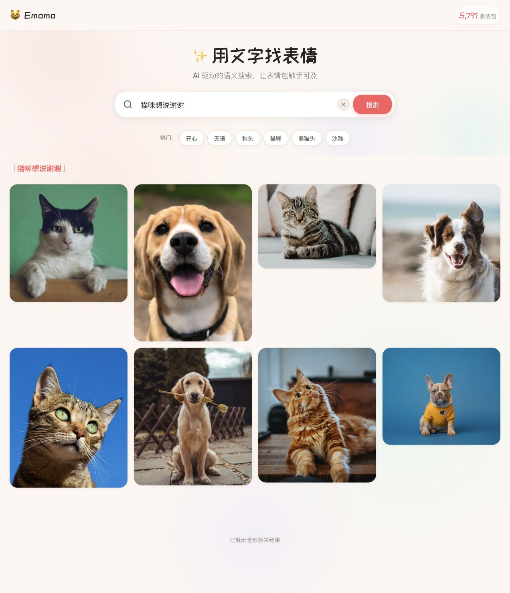
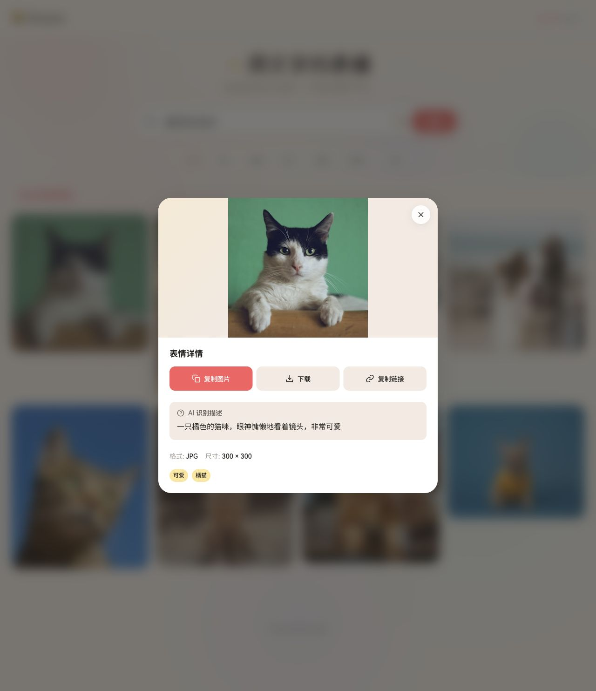
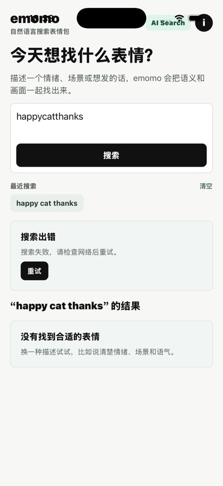

# emomo 产品说明

> 面向普通用户的功能说明。本文档按当前产品行为持续更新，每次功能变化都应在“版本记录”里追加一条记录，并更新对应页面、按钮和截图。

## 当前版本记录

| 日期 | commit | 验证范围 | 截图目录 |
| --- | --- | --- | --- |
| 2026-06-09 | `ec86554` | Web 本地运行、浏览器/CDP 截图、iOS Simulator + Expo Go、移动端测试/typecheck/lint | [docs/assets/product-guide/ec86554](assets/product-guide/ec86554/) |

本次验证打开了当前项目 App：

- Web：`http://127.0.0.1:5173/`，使用当前前端代码运行。
- iOS：`iPhone 17` Simulator，通过 Expo Go 打开当前移动端 App。
- 当前在线内容不可用时，Web 会显示本地示例内容；移动端会显示错误提示和重试入口。这是当前版本下用户实际能看到的状态。

## 一句话介绍

emomo 是一个表情包搜索工具。你可以用自然语言描述情绪、场景或想表达的话，快速找到适合聊天使用的表情图。

## Web 端

### 首页



首页的主要作用是让用户直接开始搜索，也可以先随便浏览示例表情。

- 顶部 `Emomo`：点击后回到首页，清空当前搜索状态。
- 右上角表情包数量：展示当前表情库规模；当在线统计不可用时，会显示内置默认数量。
- 搜索框：输入你想找的表情，例如“猫咪想说谢谢”“无语”“狗头”。
- `搜索`：有输入内容时可点击；点击后开始查找表情。
- 输入框里的 `X`：清空当前输入。清空后回到随便逛逛状态。
- 热门标签：点击 `开心`、`无语`、`狗头`、`猫咪`、`熊猫头`、`沙雕` 会自动把标签填入搜索框并发起搜索。
- `随便逛逛`：展示可浏览的表情。在线内容加载失败时，会显示本地示例内容，并出现重试入口。
- `重试加载`：重新尝试加载随便逛逛内容。

### 搜索结果


搜索后页面会进入结果视图。

- 搜索框会保留本次搜索词，方便继续修改。
- 搜索词标题会以 `「搜索词」` 的形式显示，帮助用户确认当前结果来自哪次搜索。
- 图片网格展示匹配到的表情。点击任意图片会打开详情弹窗。
- 鼠标移到图片上时，会出现两个快捷按钮：
  - `复制表情链接`：把该表情图片链接复制到剪贴板。
  - `下载表情`：下载该表情图片。
- 如果匹配度偏低，页面会提示当前结果更像相近情绪或相近语境，提醒用户可以换一种描述。
- 结果展示完后会显示 `已展示全部相关结果`。

### 搜索进度与取消



当在线搜索正常进入处理流程时，页面会展示阶段进度：

- `理解意图`：理解用户想找什么。
- `生成向量`：把搜索描述转换成可匹配的语义信息。
- `搜索`：在表情库里查找相近结果。
- `加载`：整理并显示结果。
- `取消`：中止当前搜索，页面停止等待结果。

如果在线搜索不可用，页面会退回本地示例结果，让用户仍然可以浏览、打开详情、复制或下载。

### 表情详情



点击图片后会打开 `表情详情`。

- 大图：展示当前表情。
- `X` / 点击弹窗外部 / 按 `Esc`：关闭详情，回到列表。
- `复制图片`：优先复制图片本身，成功后按钮会变成 `已复制`。
- `下载`：下载当前图片，成功后按钮会短暂显示 `已下载`。
- `复制链接`：复制当前图片链接，适合粘贴到不支持图片剪贴板的地方。
- `AI 识别描述`：用一句话解释图片内容，帮助用户判断是否适合当前聊天场景。
- `格式`、`尺寸`：展示图片文件信息。
- 标签：展示图片相关标签，例如可爱、橘猫等。

复制成功状态如下：


### 窄屏布局


在手机宽度的浏览器里，页面会自动变成窄屏布局：

- 搜索框和按钮上下排列，更适合单手操作。
- 热门标签自动换行。
- 表情网格变成两列。
- 加载失败、重试等状态会显示在页面底部。

## iOS / 移动端 App



移动端是免登录 App，打开后直接进入搜索。

### 顶部区域

- `emomo`：品牌标识。
- 副标题：显示“自然语言搜索表情包”或可搜索的表情数量。
- `AI Search`：表示当前是 AI 搜索模式。
- `i`：打开关于与隐私信息。

### 搜索区

- 输入框：可以输入情绪、场景或想表达的话。
- `搜索`：有输入内容时可点击；点击后开始搜索。
- 搜索中按钮会变成 `取消`，点击可停止本次搜索。
- App 会记录最近搜索，显示在 `最近搜索` 区域。
- 最近搜索词：点击后会再次用这个词搜索。
- `清空`：清除本机保存的搜索历史。

### 搜索状态

移动端搜索会显示清晰状态：

- 搜索正常进行时，会展示理解、向量、搜索、整理等进度。
- 搜索失败时，会显示 `搜索出错` 和原因。
- `重试`：重新执行上一条搜索。
- 没有结果时，会提示“没有找到合适的表情”，并建议换一种描述。

### 表情列表与详情

移动端使用两列瀑布流展示表情。

- 点击任意表情卡片会打开 `表情详情`。
- 详情页会展示大图、描述、分类和标签。
- `分享`：打开系统分享面板。
- `保存`：保存到相册；如果没有相册权限，会提示授权后再试。
- `复制图片`：把图片复制到系统剪贴板；失败时提示使用分享或保存。
- `关闭`：退出详情页。

### 关于与隐私

`i` 入口包含三类信息：

- 隐私政策：说明搜索请求会发送到 emomo 后端用于返回结果。
- 支持与反馈：打开项目 Issues 页面。
- 本机数据：说明 v1 没有账号系统，搜索历史只保存在本机，也可以清空。

## 当前版本的用户可见边界

- Web 和移动端都可以打开当前 App。
- Web 当前可展示本地示例内容，并支持搜索框、热门标签、详情、复制、下载和响应式布局。
- iOS Simulator 当前可打开 App、输入搜索词、保存最近搜索，并展示搜索失败、重试、空结果等状态。
- 当前在线 API 返回的数据形态与前端/移动端解码方式不完全一致，因此本地运行时在线内容会落到兜底或错误状态。普通用户看到的是“示例内容 / 搜索失败 / 重试”这类提示，不需要理解技术原因。

## 后续更新方式

每次产品功能变化后，按以下方式更新本文档：

1. 在“当前版本记录”表格顶部追加新 commit 的验证记录。
2. 重新运行 Web 或移动端 App，覆盖对应截图目录。
3. 对新增页面、按钮和状态补充说明。
4. 如果某个旧按钮、入口或状态被删除，从正文中移除。
5. 保持正文面向普通用户，把技术实现、接口、测试命令放在维护记录里。

更新条目模板：

```md
| YYYY-MM-DD | `commit` | Web / iOS / Android / 其他验证范围 | docs/assets/product-guide/<commit>/ |
```

## 维护记录

本次执行过的验证：

- `VITE_API_BASE=https://api.emomo.net/api/v1 npm run dev -- --host 127.0.0.1 --port 5173`
- 浏览器/CDP 打开 `http://127.0.0.1:5173/` 并采集 Web 截图。
- `CI=1 EXPO_PUBLIC_API_BASE=http://127.0.0.1:18080/api/v1 npx expo start --ios --go --localhost --port 8083`
- XcodeBuildMCP 打开 `iPhone 17` Simulator 并采集 iOS 截图。
- `cd mobile && npm run test -- --runInBand`
- `cd mobile && npm run typecheck`
- `cd mobile && npm run lint`
